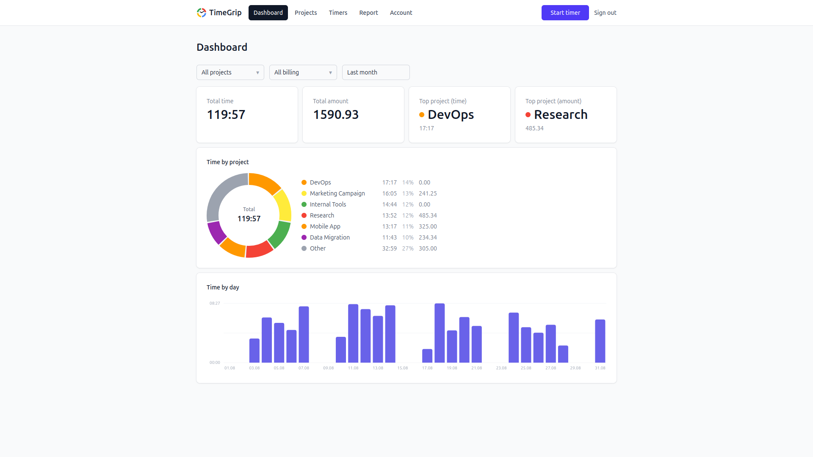
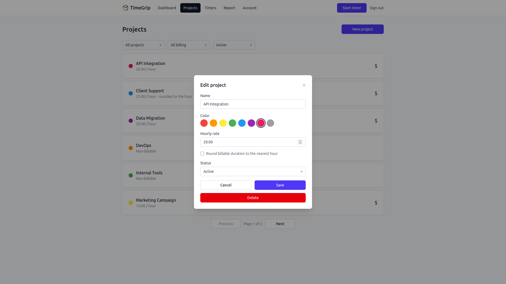
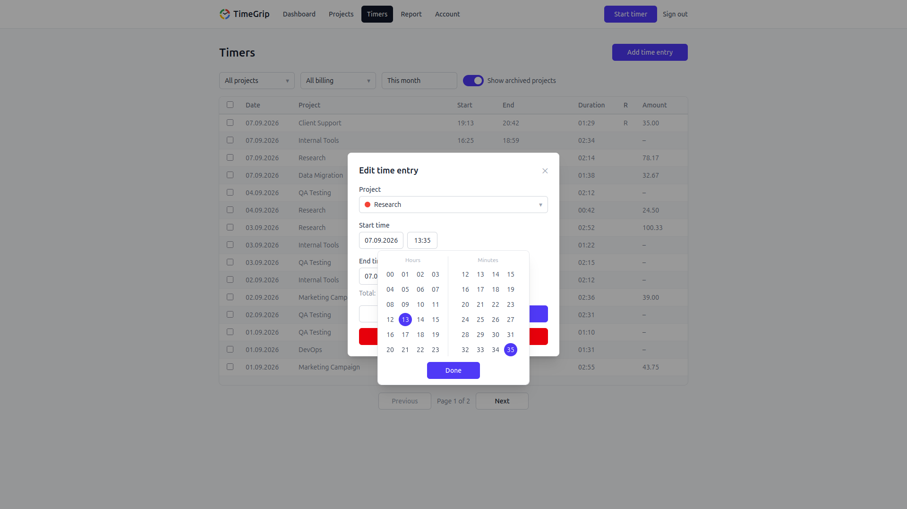
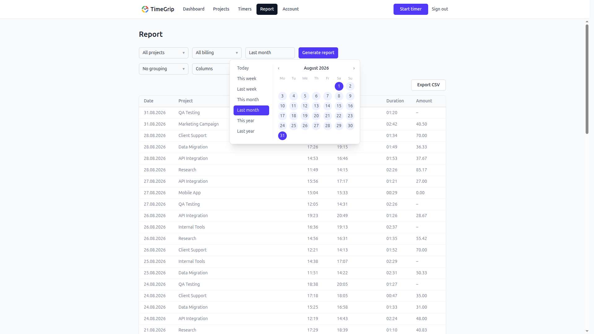

[](README.md)

# TimeGrip

[](LICENSE)
[](https://github.com/psf/black)

**Трекер времени с открытым кодом, который можно развернуть на своём сервере.**
Ведите работу по проектам, учитывайте часы таймером или ручными записями и получайте данные о том, сколько стоит время потраченное на проект: задайте почасовую ставку для проекта, и сумма к оплате посчитается сама.

[**Попробовать на timegrip.ru**](https://timegrip.ru) ·
[Документация API](https://timegrip.ru/api/docs) ·
[Приложение для Android](https://github.com/andprov/timegrip-client/releases)

<picture>
  <source media="(prefers-color-scheme: dark)" srcset="frontend/public/img/home/Dashboard-dark.png">
  
</picture>

## Возможности

- **Проекты.** Отмечайте их цветом, архивируйте завершённые без потери
  истории, задавайте почасовую ставку для каждого проекта.
- **Таймер или ручной учёт.** Запускайте таймер в начале работы или
  добавляйте и правьте записи потом. Пересечения записей отслеживаются
  автоматически.
- **Расчёт стоимости.** Сумма к оплате считается по ставке проекта, при
  желании с округлением до ближайшего часа.
- **Отчёты.** Любой период, фильтры по проекту и признаку оплаты, итоги по
  проектам или по дням, экспорт в CSV.
- **На любом экране.** Адаптивный интерфейс для компьютера и телефона,
  светлая и тёмная темы, русский и английский языки.
- **REST API.** Всё, что умеет приложение, доступно через задокументированный
  API, так что можно делать свои интеграции.
- **Приложение для Android.** [Нативный клиент](https://github.com/andprov/timegrip-client)
  работает с тем же аккаунтом, в облаке или на вашем сервере.
- **Android-клиент работает офлайн.** Таймер можно запустить без сети, а все записи будут синхронизированы при появлении сети.
- **Ставка сохраняется в каждой записи.** Если поменять ставку проекта, старые записи не пересчитываются: уже выставленные счета не «поплывут».

<table>
  <tr>
    <td></td>
    <td></td>
    <td></td>
  </tr>
</table>

## Почему TimeGrip

- **Данные остаются у вас.** Облачные сервисы хранят все данные у себя. TimeGrip можно развернуть на собственном сервере.
- **Бесплатно и без тарифов.** Все функции доступны бесплатно.
- **Ничего лишнего.** TimeGrip в отличие от большинства платформ, желающих совместить в себе сложные корпоративные решения, имеет только нужный набор функций для учета и расчета стоимости времени.
- **Открытый код.** Лицензия AGPL-3.0.

## Быстрый старт

Нужен Linux-сервер (`amd64` или `arm64`, подойдёт и Raspberry Pi) с Docker,
открытыми портами `80` и `443` и доменом, который указывает на этот сервер.
Репозиторий не нужен, только три файла из последнего релиза:

```bash
mkdir timegrip && cd timegrip
base=https://github.com/andprov/timegrip/releases/latest/download
curl -fLO $base/docker-compose.yml
curl -fL $base/env.example -o .env
curl -fL $base/seo.config.example.json -o seo.config.json
```

В `.env` задайте `DOMAIN`, `SECRET_KEY` (случайная строка, например результат
`openssl rand -hex 32`), `POSTGRES_PASSWORD` и настройки `SMTP_*` вашего
почтового ящика. В `seo.config.json` укажите `siteUrl` и `title` или
запускайте без SEO, добавив в `.env` строку `SEO_CONFIG_FILE=/dev/null`.
Затем запустите:

```bash
docker compose up -d
```

Откройте `https://<ваш домен>/`: сайт сразу работает по HTTP и переходит на
HTTPS, как только выпущен сертификат Let's Encrypt, обычно за минуту-две.
Обновление, сертификаты и бэкапы описаны в
[docs/DEPLOY.md](docs/DEPLOY.md).

## Попробовать локально

> [!NOTE]
> Только для знакомства с приложением и разработки: образы собираются из
> исходников, сайт работает по HTTP на `localhost` без сертификатов, письма
> пишутся в лог вместо отправки. Для настоящего использования —
> [Быстрый старт](#быстрый-старт).

Нужен Docker:

```bash
git clone https://github.com/andprov/timegrip.git
cd timegrip
cp .env.example .env
```

В `.env` задайте `SECRET_KEY` случайной строкой (например, результатом
`openssl rand -hex 32`) и `EMAIL_SENDER_BACKEND=console`. Тогда письма,
например коды активации при регистрации, не отправляются, а пишутся в лог
сервиса `outbox_email`. Затем запустите:

```bash
docker compose -f docker-compose.dev.yml up -d --build
```

Откройте `http://localhost/`. Документация API находится по адресу
`http://localhost/api/docs`.

Чтобы посмотреть приложение с данными (10 проектов, записи примерно за три
месяца), загрузите [tools/seed/seed.sql](tools/seed/seed.sql) и войдите как
`user@example.com` / `Passw0rd`:

```bash
docker compose -f docker-compose.dev.yml exec -T db psql -U postgres -d timegrip < tools/seed/seed.sql
```

## Документация

Документация на английском:

- [docs/DEPLOY.md](docs/DEPLOY.md): развёртывание в продакшене из готовых
  образов (amd64 и arm64, включая Raspberry Pi) с HTTPS, настройка и SEO
- [docs/DEVELOPMENT.md](docs/DEVELOPMENT.md): запуск бэкенда и фронтенда без Docker, тесты и линтеры

## Стек

```text
backend/    FastAPI + Postgres
frontend/   React + Vite SPA
gateway/    nginx reverse proxy и certbot (сертификаты Let's Encrypt)
```

## Лицензия

[AGPL-3.0](LICENSE)
